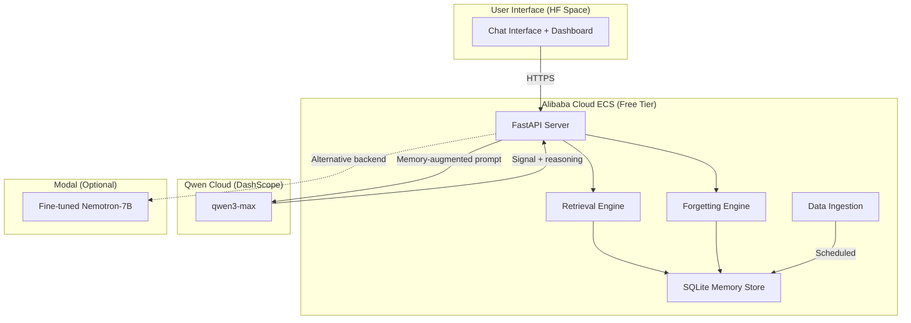
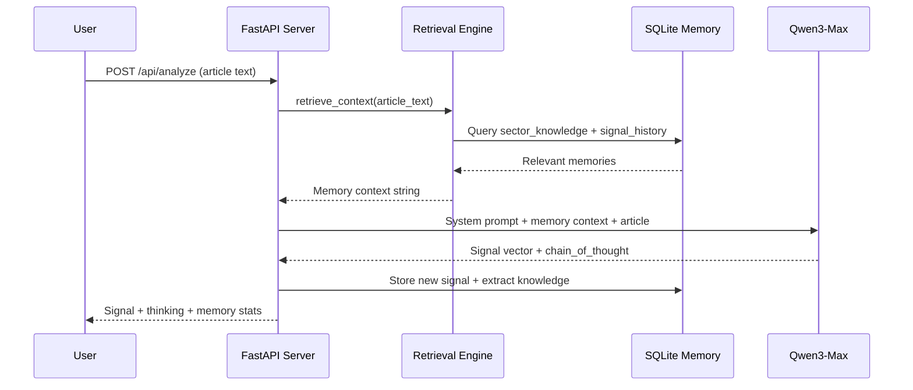
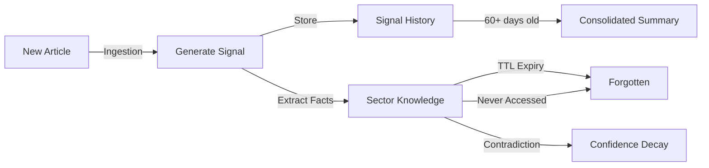

# Architecture Diagram

```mermaid
graph TB
    subgraph "User Interface (HF Space)"
        UI[Chat Interface + Dashboard]
    end

    subgraph "Alibaba Cloud ECS (Free Tier)"
        API[FastAPI Server]
        MEM[SQLite Memory Store]
        RET[Retrieval Engine]
        FOR[Forgetting Engine]
        ING[Data Ingestion]
    end

    subgraph "Qwen Cloud (DashScope)"
        QWEN[qwen3-max]
    end

    subgraph "Modal (Optional)"
        VLLM[Fine-tuned Nemotron-7B]
    end

    UI -->|HTTPS| API
    API --> RET
    RET --> MEM
    API --> FOR
    FOR --> MEM
    API -->|Memory-augmented prompt| QWEN
    API -.->|Alternative backend| VLLM
    ING -->|Scheduled| MEM
    QWEN -->|Signal + reasoning| API
```

## Memory Flow

```mermaid
sequenceDiagram
    participant User
    participant API as FastAPI Server
    participant Ret as Retrieval Engine
    participant Mem as SQLite Memory
    participant LLM as Qwen3-Max

    User->>API: POST /api/analyze (article text)
    API->>Ret: retrieve_context(article_text)
    Ret->>Mem: Query sector_knowledge + signal_history
    Mem-->>Ret: Relevant memories
    Ret-->>API: Memory context string
    API->>LLM: System prompt + memory context + article
    LLM-->>API: Signal vector + chain_of_thought
    API->>Mem: Store new signal + extract knowledge
    API-->>User: Signal + thinking + memory stats
```

## Memory Lifecycle

```mermaid
graph LR
    A[New Article] -->|Ingestion| B[Generate Signal]
    B -->|Store| C[Signal History]
    B -->|Extract Facts| D[Sector Knowledge]
    D -->|TTL Expiry| E[Forgotten]
    D -->|Never Accessed| E
    C -->|60+ days old| F[Consolidated Summary]
    D -->|Contradiction| G[Confidence Decay]
```
